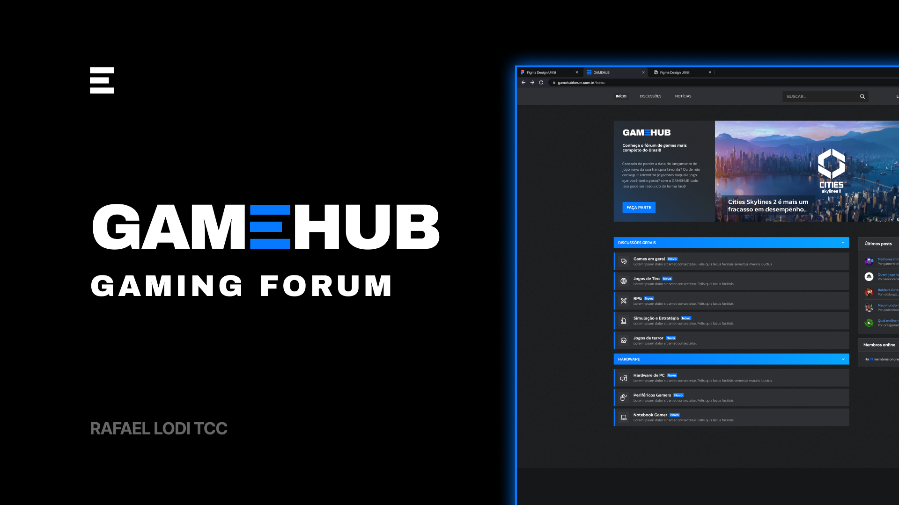

<h1 align="center">
  
</h1>

<p align="center">
  <a href="#-tecnologias">Tecnologias</a>&nbsp;&nbsp;&nbsp;|&nbsp;&nbsp;&nbsp;
  <a href="#-projeto">Projeto</a>&nbsp;&nbsp;&nbsp;|&nbsp;&nbsp;&nbsp;
  <a href="#-como-executar">Como executar</a>&nbsp;&nbsp;&nbsp;|&nbsp;&nbsp;&nbsp;
</p>

<p align="center">
  
</p>

## ✨ Tecnologias

Esse projeto foi desenvolvido com as seguintes tecnologias:

Front-end:
- [NextJS](https://nextjs.org/)
- [TypeScript](https://www.typescriptlang.org/)
- [TailwindCSS](https://tailwindcss.com/)
- [NextAuth.js](https://next-auth.js.org/)
- [React Hook Form](https://react-hook-form.com)
- [Zod](https://github.com/colinhacks/zod)
  
Backend:
- [NestJS](https://nestjs.com/)
- [TypeScript](https://www.typescriptlang.org/)
- [PostgreSQL](https://www.postgresql.org/)
- [Prisma](https://www.prisma.io/)
- [Vitest](https://vitest.dev/)


## 💻 Projeto

Gamehub é uma aplicação de fórum e notícias de jogos, onde é possível criar e comentar tópicos, assim como visualizar notícias criado pelos administradores da plataforma.

Este é um projeto desenvolvido para meu TCC da [Unicesumar EAD](https://www.unicesumar.edu.br/)

## 🎲 Como executar

```bash
# Instale no NodeJS na versão mais recente

# Clone este repositório
$ git clone https://github.com/rafaelcardeallodi/gamehub

# Acesse a pasta do projeto no terminal/cmd
$ cd gamehub

# Para rodar cada projeto, siga os passos abaixo:

---
# Back-end
# Instale as dependências
$ cd server && npm install 

# Com o docker instalado na máquina, execute o docker-compose para fazer a criação do banco de dados
$ docker-compose up -d

# Após subir o container do Docker, execute as migrations do prisma para criar as tabelas no banco de dados
$ npx prisma migrate dev

# Após isso, basta rodar o projeto utilizando o script de execução
$ npm run start:dev

# A aplicação pode ser acessada em http://localhost:3333

-----
# Front-end
# Instale as dependências
$ cd web && npm install

# Execute a Aplicação em Desenvolvimento
$ npm run dev

# A aplicação pode ser acessada em http://localhost:3000
```

Feito com ♥ by Rafael Lodi 👋🏻
